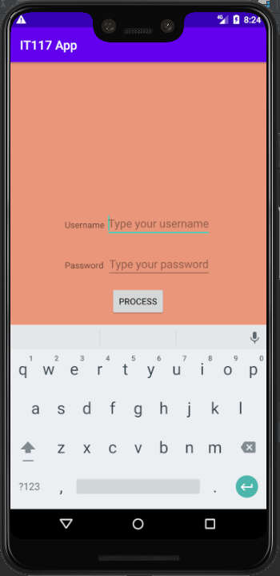
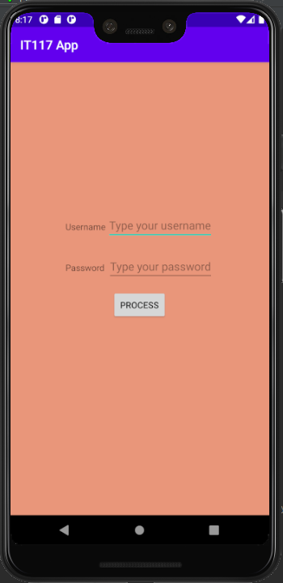
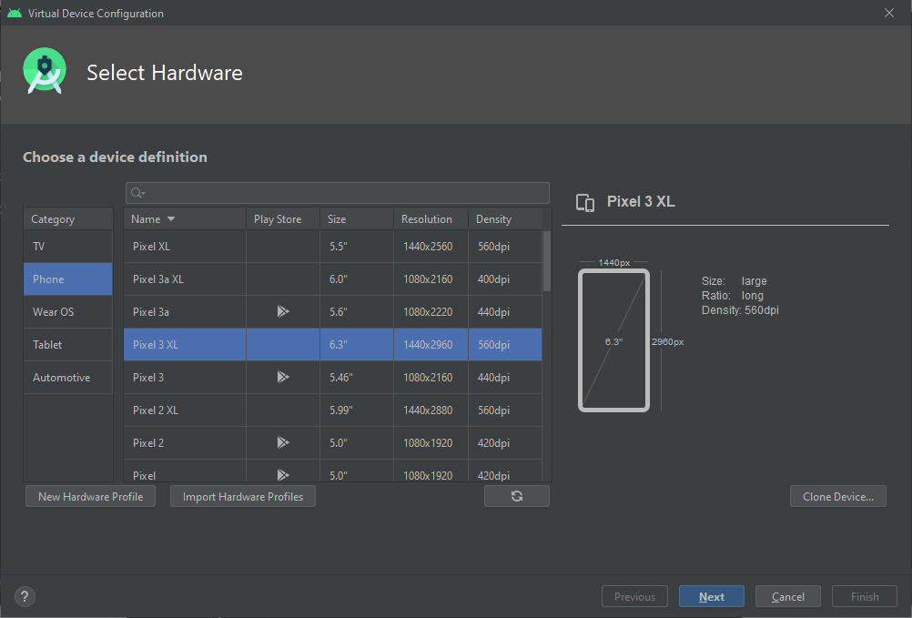
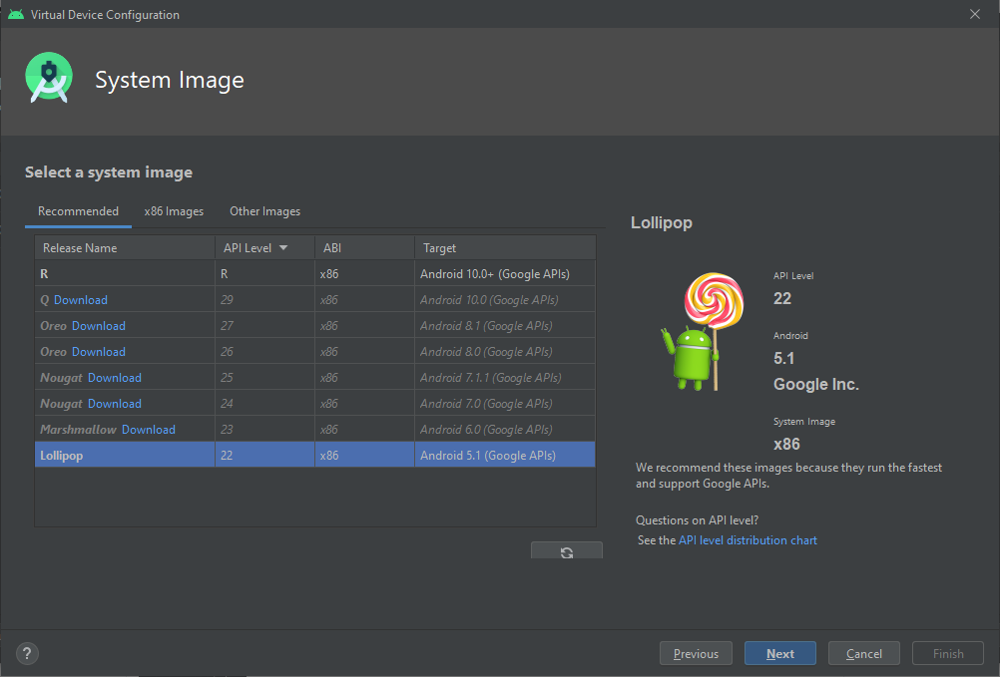
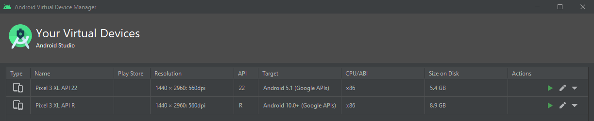

# Android Demo (June 6, 2020)
You may **clone** this repository and open the folder with **Android Studio**. You will see the *Android icon* as folder icon if you will do so. Wait for **Gradle** to set up the project. After installing requirements, you can now run the app via an **Android Virtual Device** or your **Android Phone**. Look for steps on how to connect your Android phone to Android Studio. It will require you to enable **Developer Options**.

## Preview @ Pixel 3 XL Android 22 a.k.a. Lollipop

## Preview @ Pixel 3 XL Android R (Latest)

## How To Create Pixel 3 XL Android Lollipop

### Step 1
Choose **Pixel 3 XL** as android device. Then click **Next**.

### Step 2
Choose **Lollipop** as android system image or operating system. If you haven't downloaded it yet, just click the **Download Link** button beside **Lollipop**. It will take some time depending on your internet connection. After downloading, click **Next**. Boot it up and you now have an AVD or *Android Virtual Device*!

## Tip
For developers with low specs computers, it will be better to download Android Lollipop instead of Android R as the former is lighter than the latter.

As what you can see on the **Size on Disk** column, Lollipop only consumes **~5.4 GB** while Android R consumes **~8.9 GB**. Both of them does not have **Google Playstore** so that will really make Android R *heavier* than it already is. Also, based on my experience, Android Lollipop boots a lot faster than Android R.

**P.S.** If you have an **Android Phone**, you can actually use that instead of the **Android Virtual Device**. Both **Gradle** and **Android Virtual Device** consumes a lot of RAM resources so it would be a lot better if you will use your **Android Phone** instead for development purposes.